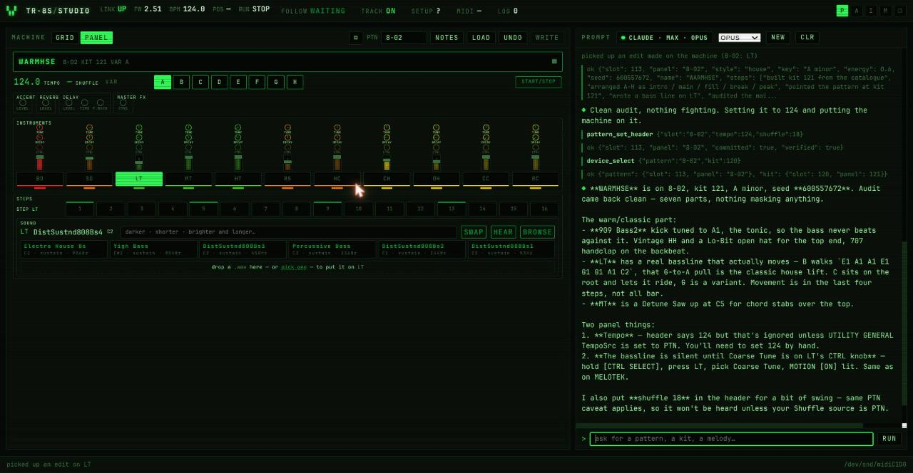
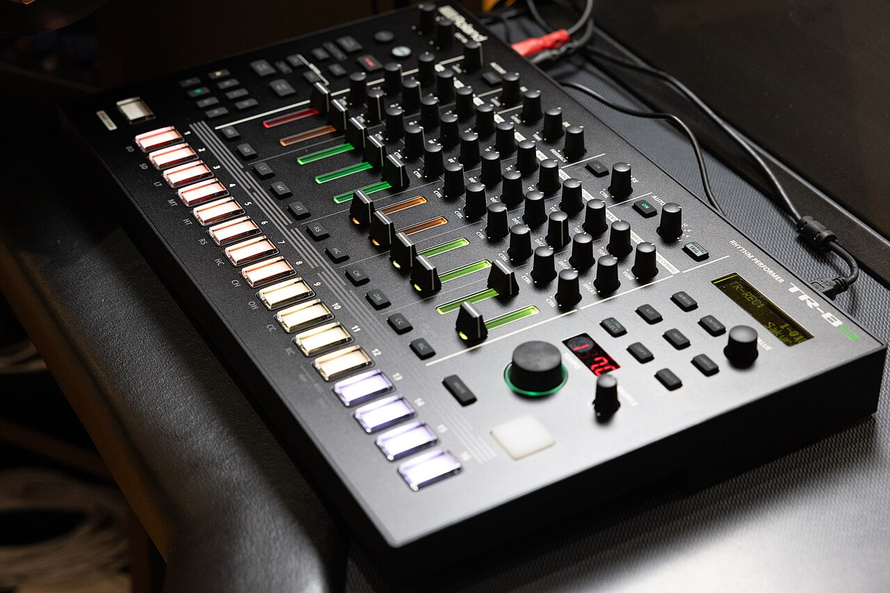
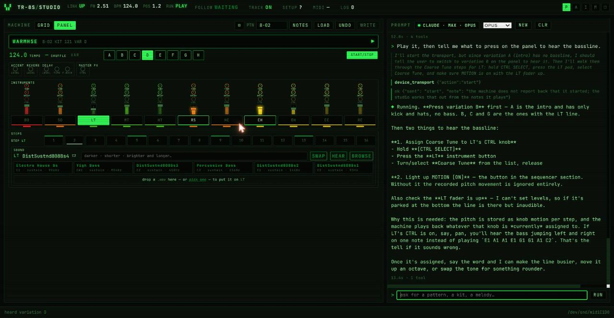
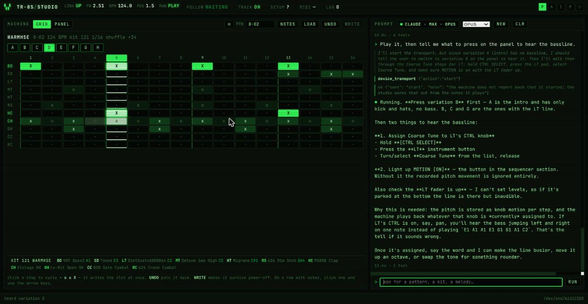
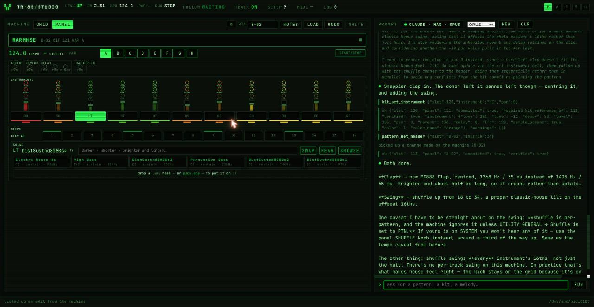
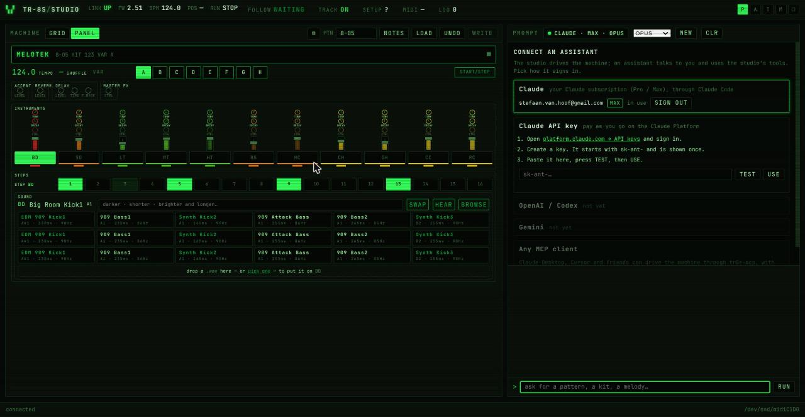
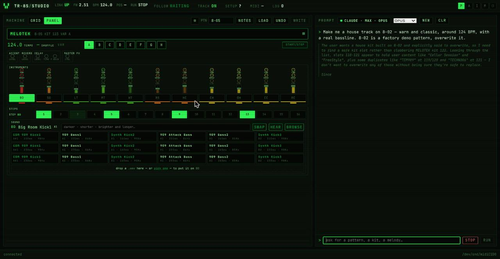
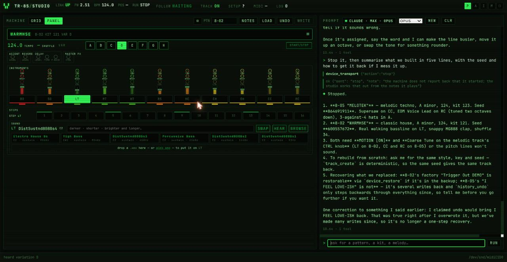

# TR-8S Studio

**Talk to your Roland TR-8S. Get a track back.**

An open-source studio for the Roland TR-8S drum machine: a web UI that mirrors
the machine live, a reverse-engineered SysEx layer that reads and writes every
pattern and kit byte-exact, and an AI assistant that turns "make me a warm
house track with a real bassline" into a finished, playing pattern in about a
minute, using your own Claude subscription.

> "Make me a house track on 8-02, warm and classic, around 124 BPM, with a
> real bassline."
>
> 74 seconds later: a kit chosen from measured tones, eight arranged
> variations, a walking bassline in A minor, the machine switched to it, the
> seed reported, undo offered.



**Watch it happen (1 min, machine audible):** https://youtu.be/9lKcmGzcwPQ

## First, what is a TR-8S?



The Roland TR-8S is a drum machine: a box that plays drum sounds in a pattern
you program by pressing buttons. Sixteen pads along the bottom are the
sixteen steps of a bar; press a pad and the selected drum sounds on that
step. Eleven instruments (kick, snare, toms, rimshot, clap, hats, cymbals)
each have their own row of steps, a fader for level and knobs for tune,
decay and one more thing. Eight variations, A to H, let you build an intro,
a main groove, a break and a drop, and 128 slots hold your patterns. It has
the sounds of the old 808 and 909 that half of dance music was built on, plus
samples. Nearly every techno, house and hip hop record you know started on a
machine like this, and many still do.

It is a wonderful instrument and a brick wall of a learning curve.

**This software needs the real machine.** It talks to the TR-8S over its USB
cable; it does not emulate one, and nothing here makes a sound on its own.
Plug the machine in, start the studio, and the two become one instrument.

*Photo: "Roland TR-8S Drum Machine" by Nir Yaniv,
[Wikimedia Commons](https://commons.wikimedia.org/wiki/File:Roland_TS-8S_Drum_Machine.jpg),
[CC BY-SA 4.0](https://creativecommons.org/licenses/by-sa/4.0/).*

## The vision

This is not another tool for letting an AI make music. There are better ones
for that, and that was never the point.

The point is the person at the machine. A drum computer is a wonderful thing
to learn on and a hard thing to learn from: sixteen buttons, eleven sounds, a
hundred settings, and no one to tell you why the hats go *there* and what
makes a groove roll. **TR-8S Studio wants to be the tutor sitting next to
you.** It should be able to say "that's a house beat; the clap on two and four
is what you're hearing; try moving the open hat to the offbeat and listen to
what changes", let you do it with your own fingers on the real pads, hear
what you did, and tell you what just happened in words a beginner can use.

Where it goes from there: genre lessons you play through rather than read,
the assistant as a patient teacher rather than a producer-for-hire, and a
playful layer on top: think sprites and little crowds that get moving when the
groove locks in, a bit of Guitar Hero spirit in service of actually learning
an instrument. Rhythm, genres, drum programming, and the joy of it.

The pieces that exist today (live mirror of the machine, the assistant that
sees what you see, sounds chosen from measurement, melodies, undo) are the
foundation for that. The tutoring, the lessons and the fun on top are wide
open.

## Why it exists

It started as a small question: can a Linux laptop read a pattern off a
TR-8S over USB? The protocol turned out to be undocumented, so it was
reverse-engineered one byte at a time, verified against the hardware, and
written down. Then the studio grew around it, and then the assistant, and at
some point "make me a house track" simply worked.

Its author has three kids, one wife, and a TR-8S, and only one of those
three comes with an off switch. The other two have made it clear that this
does not get to become a second job. So it is here, in the open, for anyone
who finds the idea as exciting as he does. **It is up for grabs.** Fork it,
take it somewhere, join in, and please do. He will be in the comments, in
between bedtimes.

## What it does

**A studio that follows the machine.** Change pattern on the TR-8S and the
studio is there. Play it and every step lights as it sounds, the variation
letter is recognised by ear, knobs and faders move on screen as you touch
them. Add a step on the panel while it plays and TRACK jumps to that
instrument within a bar. Nothing is polled; the machine is the source of
truth.



**Editing that is live.** Click a step in the grid or on the pads and the
machine has it before the bar comes round. A write lands in what is playing,
so there is no "load", no "send", no waiting for a stop.



**An assistant that works the way a collaborator does.** It sees what you
see: the pattern on screen, whether the machine is playing, which variation is
heard, what changed recently and who changed it. It reasons out loud, calls
the studio's tools, and tells you in musical terms what it did.

- *"The clap needs more snap, and give the hats a little swing."*
  It swapped the clap for a shorter, brighter one chosen by measured decay and
  brightness, centred its pan, and set shuffle, then told you the one caveat
  that matters on this machine.
- *"Play it, then tell me what to press to hear the bassline."*
  It started the transport and walked you through Coarse Tune and MOTION ON,
  which the hardware needs and cannot do for you.
- *"Stop, and summarise what we built."*
  Five lines, both tracks from the session, seeds included, and a correction
  of something it had said earlier about undo.



**Sounds chosen from data, not names.** Every melodic tone on the machine has
been measured: the note it really sounds at, how long it rings, how bright it
is. "A darker, shorter kick" is a query, not a guess, and a bassline comes out
in key because the tone's real root is looked up first.

**Melodies the hardware makes almost impossible by hand.** Per-step Coarse
Tune motion, four octaves, exact semitones, written as note names.

**A memory.** A colour-coded change log records what the user did on the
panel, what the studio did, and what the assistant did, and it survives
restarts. So does the conversation.

**Safety rails.** Every mutating tool snapshots the slot it is about to
change, so there is an undo ring. The assistant reads before it overwrites
and says what it is replacing.

## Bring your own assistant



- **Claude, with the subscription you already have.** Sign in once through the
  browser; the studio shows who is signed in and on which plan. This runs on
  the Claude Agent SDK, which drives the same `claude` binary you use in the
  terminal.
- **Claude with an API key.** Three steps in the UI, a TEST button that makes a
  real call, then USE.
- **Any MCP client.** Claude Desktop, Cursor and friends can drive the machine
  through `tr8s-mcp` with their own sign-in.
- OpenAI and Gemini backends are on the list; the tool registry is
  provider-neutral and contributions here are very welcome.

*A note on terms: Anthropic's Agent SDK documentation does not allow
third-party products to offer claude.ai login without approval. Signing in
with your own account on your own machine, as this studio does, is personal
use. Do not redistribute a hosted version of this with subscription login.*

## Quick start

```bash
git clone <this repo> && cd tr8s
python3 -m venv .venv && .venv/bin/pip install -e . claude-agent-sdk anthropic
# plug in the TR-8S over USB, then:
scripts/restart.sh                     # finds the MIDI port, starts the studio
# open http://127.0.0.1:8733
```

For the assistant, either have [Claude Code](https://claude.com/code)
installed and signed in (`claude auth login`), or paste an API key in the
studio's connect panel. `scripts/restart.sh --offline` runs the UI without a
machine.

On the TR-8S, three settings make the studio's life easy: UTILITY → MIDI →
**Tx Prog Chg ON** (pattern follow), **Tx EditData ON** (knob follow and the
beat counter), and UTILITY → GENERAL → tempo, shuffle and kit sources set to
**PTN** so per-pattern settings are honoured.

## Under the hood

- `src/tr8s/transport.py`, `device.py`, `pattern.py`, `kit.py` — the wire
  format and the models. The protocol is reverse-engineered and documented in
  [`docs/PROTOCOL.md`](docs/PROTOCOL.md), every claim marked verified or not.
- `src/tr8s/tools/` — 52 tools, one decorator each with a JSON schema. The
  same registry drives the CLI, the studio, the assistant and the MCP server.
- `src/tr8s/server.py` — the studio: HTTP + SSE, following, live overlay,
  panel-edit detection.
- `src/tr8s/agent.py` — the assistant on the Claude Agent SDK, tools served
  in-process as an MCP server (only this process can hold the MIDI port).
- `src/tr8s/web/` — vanilla HTML, JS and CSS. No build step.
- `docs/` — start with [`HANDOFF.md`](docs/HANDOFF.md);
  [`LESSONS.md`](docs/LESSONS.md) is every trap already hit, with the fix.

465 tests run without hardware against a fake transport. Verified against a
real TR-8S on firmware 2.51.

## Things the hardware imposes

Bulk SysEx reads hang while the machine plays, so the studio reads only when
it stops and hears the rest. The panel sends nothing when a step is toggled or
a variation is selected; both are recognised from what plays. Levels belong to
the physical faders and cannot be set. Melodies need Coarse Tune on the
instrument's CTRL knob and MOTION ON, by hand. The studio and the assistant
know all of this and say so at the moment it matters, not before.

## More of the session

The assistant thinking out loud while it reads the slot and picks a safe kit:



And the wrap-up, both tracks of the session summarised from memory, with the
seeds and a self-correction about undo:



## Contributing

This project moved from "can we even read a pattern" to "make me a house
track" in a few days, and the vision above is mostly unbuilt. It is meant to
be picked up by many hands, not maintained by one. Some directions:

- **The tutor.** Lessons a beginner plays through: what a backbeat is, why
  house and techno differ, where swing lives. The assistant explaining what
  the user just did on the pads, not only doing things for them.
- **The fun layer.** Sprites, a crowd, something that reacts when the groove
  locks in. The machine already tells the studio every hit as it happens.

- **More assistants.** An OpenAI or Gemini backend over the same tool
  registry.
- **Music intelligence.** Better mappings from words ("hypnotic", "peak
  time", "dubby") to steps and tones; critique from recorded audio.
- **A pattern library** worth keeping, loadable by name, with what each is for.
- **Performance.** Variation chaining, timed fills, mute groups.
- **Other machines.** The architecture (transport, models, tools, studio,
  assistant) is not TR-8S specific in shape.

Read [`docs/HANDOFF.md`](docs/HANDOFF.md) first, then
[`docs/UX-NOTES.md`](docs/UX-NOTES.md) for known rough edges that are good
first issues. Run `pytest tests/` before and after.

## Licence

MIT. See [`LICENSE`](LICENSE).
